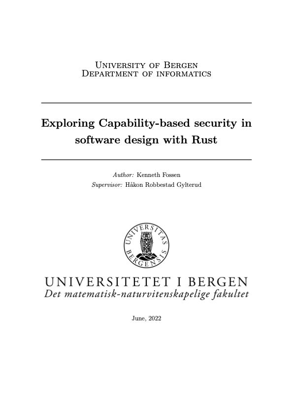

<!-- _class: lead -->

# ID And AccessControl

## Kenneth Fossen

### Dragefjellet

---
<!-- _class: center -->
# GitHub Repo

[https://github.com/kenneth-fossen/kefo-aspnet-security.git](https://github.com/kenneth-fossen/kefo-aspnet-security.git)

---

# $ WHOAMI

```hs
$ whoami
{
    name: Kenneth Fossen,
    dep: Dragefjellet@Bouvet,
    email: kenneth.fossen@bouvet.no,
    edu: [
        Bachelor i Datatryggleik
        Master i Programvare Utvikling
    ],
    work: [
        Helse Vest IKT Drift & Sikkerhet
    ]
    current: [
        Software Developer,
        Security Champion,
        #rustaceans
    ]
}
```

Dette er Boisy -->


---
<!-- _class: white -->

# Agenda

- Part i - Theory Covers
  - Why this is important
  - Acronyms
  - Access Control Types
  - Access Control in ASP.NET WebAPI
- Part i - Coding

---

# Agenda - cont

- Part ii - Theory Covers
  - What is OAuth / OpenID Connect
  - Tokens (JWT, ID Tokens, Access Tokens)
  - Scopes
  - Flows
    - Implicit Flow
    - Auth Code Grant
- Part ii - Coding

---

<!-- _class: center-white -->

# Part i

## Theory AccessControl

---

# Why is this important?

- OWASP Top 10 2021
  - No 1 issue
  - Moving up from the fifth position,
  - 94% of applications were tested for some form of broken access control"
  - Confused Deputy problem
  - PoLP

---

# Confused Deputy


<!-- _footer: 'Confused deputy problem. (2022, August 5). In Wikipedia. https://en.wikipedia.org/wiki/Confused_deputy_problem' -->

---

# Evil User


---

# PoLP / PoLA

Principle of Least Privilege / Access

---

# Acronyms

- principal
- subject
- authentication (AuthN)
- authorization (AuthZ)
- scopes
- authority
- claims
- tokens /JWT bearer

---

# JWT Token

```hs
 eyJhbGciOiJIUzI1NiIsInR5cCI6IkpXVCJ9
.eyJzdWIiOiIxMjM0NTY3ODkwIiwibmFtZSI6IkpvaG4gRG9lIiwiaWF0IjoxNTE2MjM5MDIyfQ
.SflKxwRJSMeKKF2QT4fwpMeJf36POk6yJV_adQssw5c
```

```json
{
  "alg": "HS256",
  "typ": "JWT"
},
{
  "sub": "1234567890",
  "name": "John Doe",
  "iat": 1516239022,
}
```

<!-- _footer: 'Use JWT.io to inspect tokens: https://jwt.io/' -->

---

# Access Control Types

ACL, RBAC, ABAC, CBAC, RBA

---

# Access Control Lists

---

```sh
> ls -la
total 0
drwxr-xr-x    5 kenneth  staff 160  Apr  5 10:48 .  # this directory
drwxr-xr-x  153 kenneth  staff 4896 Apr  5 10:48 .. # partent directory 
-r-xr-xr-x    1 kenneth  staff 0    Apr  5 10:48 read_execute_file.txt
-r--r--r--    1 kenneth  staff 0    Apr  5 10:48 read_file.txt
--w-------    1 kenneth  staff 0    Apr  5 10:48 write_file.txt
-rw---xr--    1 kenneth  staff 0    Apr  5 10:48 own_readwrite_everyone_read.txt
>
```

```sh
{-}{r-x}{ r-x}{r-x}
{type}{owner}{group}{everyone}
```

---

<!-- _class: white -->
# Role-Based Access Control


<!-- _footer: 'https://sites.google.com/site/cacsolin/role-based-access-control' -->
---

# Attribute-Based Access Control


<!-- _footer: 'https://privacera.com/blog/what-is-attribute-based-access-control/' -->
- Policy Decision Point (PDP)
- Policy Enforcement Point (PEP)
- Policy Information Point (PIP)

---
<!-- _class: center-white -->
# ABAC Infrastructure


<!-- _footer: https://fallbackstatus.com/what-is-attribute-based-access-control/ -->


---

# Capability-Based Access Control



---
<!-- _class: white -->
# Capabilities


---

# Risk-Based Authentication

[https://riskbasedauthentication.org/](https://riskbasedauthentication.org/)

---

# Access Control in ASP.NET WebAPI

- ClaimsBased
- PolicyBased

ABAC is what Microsoft calls: policy-based access control (PBAC) or
claims-based access control (CBAC)

---

# JWT

```json
{
  "aud": "api://1851a809-314c-4d44-9844-382ce9f64f85",
  "iss": "https://sts.windows.net/e5d441e9-b0fb-4458-a4d7-15d2b4cfc193/",
  "iat": 1681404264,
  "nbf": 1681404264,
  "exp": 1681408164,
  "idp": "https://sts.windows.net/e5d441e9-b0fb-4458-a4d7-15d2b4cfc193/",
  "oid": "b3da45cf-872e-41af-b1b6-713852002cac",
  "scp": [
    "profile",
    "email",
  ],
  "roles": [
    "ConsoleClientRole"
  ],
  "sub": "b3da45cf-872e-41af-b1b6-713852002cac",
  //..
}
```

<!-- _footer: 'JWT.io https://www.jwt.io -->

---

# Claims

```sh
iss:https://sts.windows.net/e5d441e9-b0fb-4458-a4d7-15d2b4cfc193/
iat:1681444727
nbf:1681444727
exp:1681448627
aio:E2ZgYFhy8uvSUm2J0PWhC2NffE7RAQA=
appid:f44c4125-7493-4ea0-8a91-77a15e9995df
appidacr:1
idp:https://sts.windows.net/e5d441e9-b0fb-4458-a4d7-15d2b4cfc193/
oid:b3da45cf-872e-41af-b1b6-713852002cac
rh:0.AYEA6UHU5fuwWESk1xXStM_BkwmoURhMMURNmEQ4LOn2T4WBAAA.
roles:ConsoleClientRole
sub:b3da45cf-872e-41af-b1b6-713852002cac
tid:e5d441e9-b0fb-4458-a4d7-15d2b4cfc193
uti:eqdCjChDh0qEAdbXP-o3AA
ver:1.0
```

---

# ClaimsTransformation

```c#
public class SecuredApiTransformClaims : IClaimsTransformation
public Task<ClaimsPrincipal> TransformAsync(ClaimsPrincipal principal)
```

---

# AuthN and AuthZ

```hs
app.UseAuthentication()
app.UseAuthorization()
```
---

# Example: Middleware Order

```c#
var builder = WebApplication.CreateBuilder(args);

// Add services to the container.
...
var app = builder.Build();

// Configure the HTTP request pipeline.
if (app.Environment.IsDevelopment())
{
    app.UseMigrationsEndPoint();
}
else
{
    app.UseExceptionHandler("/Error");
    app.UseHsts();
}

app.UseHttpsRedirection();
app.UseStaticFiles();
// app.UseCookiePolicy();

app.UseRouting();
// app.UseRequestLocalization();
// app.UseCors();

app.UseAuthentication(); // Always before Authorization
app.UseAuthorization();
// app.UseSession();
// app.UseResponseCompression();
// app.UseResponseCaching();

app.MapRazorPages();
app.MapControllerRoute(
    name: "default",
    pattern: "{controller=Home}/{action=Index}/{id?}");

app.Run();
```

---

# [Authorize] and Policies

```hs
[AllowAnonymous]

[Authorize]
[Authorize(Policy = "ConsoleClientRole")]

[Authorize(Roles = "HRManager,Finance")]

[Authorize(Roles = "PowerUser")]
[Authorize(Roles = "ControlPanelUser")]
```

```hs
builder.Services.AddAuthorization(options =>
{
    options.AddPolicy("ConsoleClientRole", policy =>
    {
        policy.RequireRole("ConsoleClientRole");
    });
```


---

# Part i - Break before Coding


---
<!-- _class: center -->

# Part i - Coding

[Tasks for Part i](https://github.com/kenneth-fossen/kefo-aspnet-security/blob/0fb48572f3238613aad7bf240d90c2ed12637741/part-I/README.md)

---

<!-- _class: center-white -->

# Part ii

## Theory OAuth and Azure

---

# OAuth

- What is OAuth


<!-- _footer: 'Source: https://aaronparecki.com/2019/12/12/21/its-time-for-oauth-2-dot-1' -->

---

# OAuth Acronyms

- Audience
- Issuer
- Scope
- Subject

---

# JWT

```json
{
  "aud": "api://1851a809-314c-4d44-9844-382ce9f64f85",
  "iss": "https://sts.windows.net/e5d441e9-b0fb-4458-a4d7-15d2b4cfc193/",
  "iat": 1681404264,
  "nbf": 1681404264,
  "exp": 1681408164,
  "idp": "https://sts.windows.net/e5d441e9-b0fb-4458-a4d7-15d2b4cfc193/",
  "oid": "b3da45cf-872e-41af-b1b6-713852002cac",
  "scp": [
    "profile",
    "email",
  ],
  "roles": [
    "ConsoleClientRole"
  ],
  "sub": "b3da45cf-872e-41af-b1b6-713852002cac",
  //..
}
```

<!-- _footer: 'JWT.io https://www.jwt.io -->

---

- Tokens
  - Id Tokens
  - Access Tokens
  - Scopes

---

# Flows

- Implicit Grant Flow
- Authorization Code Grant (PCKE)

--- 

# Implicit Grant Flow


<!-- _fotter: https://learn.microsoft.com/en-us/azure/active-directory/develop/v2-oauth2-implicit-grant-flow >
<!-- _footer: Manning: Microservice Security in Action -->

---

# Authorization Code Grant (PCKE)

- RedirectURIs
  - Common Mistake Open Redirect

<!-- _footer: https://learn.microsoft.com/en-us/azure/active-directory/develop/v2-oauth2-auth-code-flow -->

---

## Auth Code Flow


<!-- _footer: Manning: Microservice Security in Action -->
---

# AzureAd

- Service Principals / AppRegistrations
   an identity created for use with applications, hosted services, and automated tools to access Azure resources
   Users have to manage secrets and passwords
- Managed Identity
   Same as a service principal, just managed

---

# Part ii - Break before Coding


---

<!-- _class: center -->

# Part ii - Coding

Coding
[Tasks for Part ii](https://github.com/kenneth-fossen/kefo-aspnet-security/blob/66c7776230abb11b0b2c4af87c15a190d1a4fb57/part-II/README.md)

---

# Sources

- [OAuth 2.0 implicit grant flow](https://learn.microsoft.com/en-us/azure/active-directory/develop/v2-oauth2-implicit-grant-flow)

- [Microsoft identity platform and OAuth 2.0 authorization code flow](https://learn.microsoft.com/en-us/azure/active-directory/develop/v2-oauth2-auth-code-flow)

- [ASP.NET Core Middleware](https://learn.microsoft.com/en-us/aspnet/core/fundamentals/middleware/?view=aspnetcore-7.0#middleware-order)

- [Azure.Identity Nuget](https://www.nuget.org/packages/Azure.Identity)

- [Microsoft Identity Platform Documentation](https://learn.microsoft.com/en-us/azure/active-directory/develop/)

- [MsC: Capability Bases Access Control](https://github.com/spydx/capability-poc)